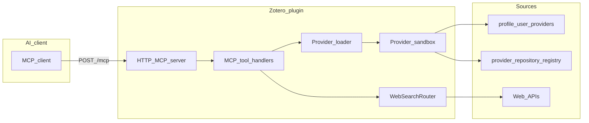

# Zotero Resource Search MCP — Design

This document records architecture and product decisions for this plugin.

## What this plugin is

**A search executor inside Zotero**, not a fixed list of hard-coded databases:

- The plugin exposes **10 MCP tools** (JSON-RPC over Streamable HTTP) for academic search, patent search/detail, web search, lookup, and Zotero writes.
- **Academic sources** are loaded as **pluggable packages** (`manifest.json` + `provider.js`) from the user profile directory, imported zips, or a configured provider repository.
- **Web search** uses a separate router (Tavily / Firecrawl / Exa / xAI / optional [MySearch-Proxy](https://github.com/skernelx/MySearch-Proxy)) and is **not** packaged as pluggable `provider.js` bundles today — it stays in `src/providers/web/`.

We **encourage custom sources**: publish a zip, share a provider repository URL, or maintain provider source in the external `resource-search-providers` repository.

## Architecture

## Pluggable academic providers

1. **Manifest** (`manifest.json`) — `id`, `name`, `version`, `sourceType`, `permissions.urls`, optional `configSchema`, `allowedGlobalPrefs`, `integrity.sha256`.
2. **Bundle** (`provider.js`) — must export a factory `createProvider(api)` returning `{ search(query, options) }`.
3. **API** (`ProviderAPI`) — injected `http`, `xml`, `dom`, `config`, `log`, `rateLimit`, and optional global prefs per manifest.

`configSchema` doubles as UI metadata for the Sources tab. Besides the value type, providers may expose labels, descriptions, advanced-only fields, enum-backed selects, placeholders, numeric bounds, and secret/password inputs.

Loading order:

1. User directory: `<ZoteroProfile>/zotero-resource-search/providers/<id>/` (same layout).
2. Imported zip packages (extracted into the user directory).
3. Provider repository installs (downloaded from release-backed `registry.json` assets into the user directory).

Remote **registry** JSON (`{ "providers": [{ "id", "version", "downloadUrl", "sha256?" }] }`) downloads zips and verifies SHA-256 when provided.

Startup is deliberately fail-soft:

- Missing user provider directories are created recursively when possible.
- A failure in one user-installed provider does not prevent the remaining academic providers or web backends from registering.
- Loader status is captured as structured startup entries and reused by the settings UI and `platform_status`.

## MCP tool surface

Ten tools keep the model’s decision space small:

| Tool                                                | Role                                           |
| --------------------------------------------------- | ---------------------------------------------- |
| `academic_search`                                   | Route to registered academic `SearchProvider`s |
| `patent_search` / `patent_detail`                   | Patent provider search + detail lookup         |
| `web_search` / `web_research`                       | Web router                                     |
| `resource_lookup`                                   | Translators + URL extract                      |
| `resource_add` / `collection_list` / `resource_pdf` | Zotero integration                             |
| `platform_status`                                   | Health by source kind                          |

`mcp/status.availableTools` and `tools/list` are generated from the same canonical tool catalog to avoid drift.

## Web routing

Intent/strategy routing follows patterns from **MySearch-Proxy** (upstream credit in README). Provider keys and base URLs live in Zotero prefs.

Web backend health is queried via registry-safe checks so diagnostics still work even if an individual backend fails to register.

## Security notes

- Provider code runs in a **sandbox** with URL allowlists from `manifest.permissions.urls`.
- Bundle size caps and optional SHA-256 checks reduce tampering risk for remote installs.

## Related docs

- [Provider SDK](development/provider-sdk.md)
- [Runtime gotchas](development/runtime-gotchas.md)
- [Agent Skill](skills/SKILL.md)
- [Versioning](development/versioning.md)
