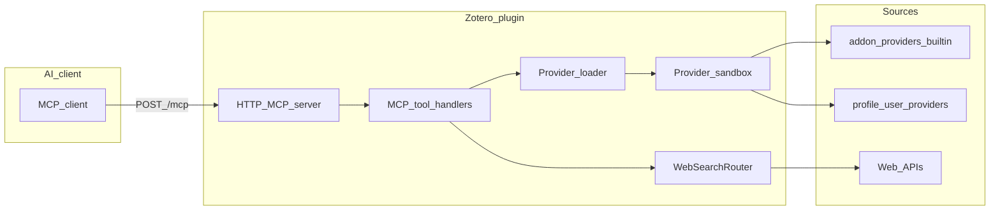

# Zotero Resource Search MCP — Design

This document records architecture and product decisions for this plugin.

## What this plugin is

**A search executor inside Zotero**, not a fixed list of hard-coded databases:

- The plugin exposes **8 MCP tools** (JSON-RPC over Streamable HTTP) for academic search, web search, lookup, and Zotero writes.
- **Academic sources** are loaded as **pluggable packages** (`manifest.json` + `provider.js`), bundled under `addon/providers/<id>/` at build time. Users can **override** or **add** sources via the profile directory or **Import .zip** in settings.
- **Web search** uses a separate router (Tavily / Firecrawl / Exa / xAI / optional [MySearch-Proxy](https://github.com/skernelx/MySearch-Proxy)) and is **not** packaged as pluggable `provider.js` bundles today — it stays in `src/providers/web/`.

We **encourage custom sources**: publish a zip, share a registry URL, or fork the repo and add packages under `src/providers/packages/<id>/`.

## Architecture

## Pluggable academic providers

1. **Manifest** (`manifest.json`) — `id`, `name`, `version`, `sourceType`, `permissions.urls`, optional `configSchema`, `allowedGlobalPrefs`, `integrity.sha256`.
2. **Bundle** (`provider.js`) — must export a factory `createProvider(api)` returning `{ search(query, options) }`.
3. **API** (`ProviderAPI`) — injected `http`, `xml`, `dom`, `config`, `log`, `rateLimit`, and optional global prefs per manifest.

Loading order:

1. Built-in list from `addon/providers/index.json`.
2. User directory: `<ZoteroProfile>/zotero-resource-search/providers/<id>/` (same layout).
3. **User wins** on duplicate `id`.

Remote **registry** JSON (`{ "providers": [{ "id", "version", "downloadUrl", "sha256?" }] }`) downloads zips and verifies SHA-256 when provided.

## MCP tool surface

Eight tools keep the model’s decision space small:

| Tool | Role |
|------|------|
| `academic_search` | Route to registered academic `SearchProvider`s |
| `web_search` / `web_research` | Web router |
| `resource_lookup` | Translators + URL extract |
| `resource_add` / `collection_list` / `resource_pdf` | Zotero integration |
| `platform_status` | Health by source kind |

## Web routing

Intent/strategy routing follows patterns from **MySearch-Proxy** (upstream credit in README). Provider keys and base URLs live in Zotero prefs.

## Security notes

- Provider code runs in a **sandbox** with URL allowlists from `manifest.permissions.urls`.
- Bundle size caps and optional SHA-256 checks reduce tampering risk for remote installs.

## Related docs

- [Provider SDK](development/provider-sdk.md)
- [Agent Skill](skills/SKILL.md)
- [Versioning](development/versioning.md)
